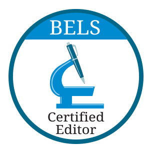

# Ravi Murugesan

Editor, Teacher, Techie
{: .fs-6 .fw-300}

For most my career, I've been a combination of a science editor and a training specialist. As a science editor, I care about responsible and effective communication of science. As a training specialist, I enjoy designing and facilitating in-person and online training programs. 

Check out my work samples on this site.

For my employment history, see [my LinkedIn profile](https://www.linkedin.com/in/ravimurugesan/).

For my publications, see [my ORCID record](https://orcid.org/0000-0002-1898-0559).

I'm looking for a full-time position, ideally in service of an educational, scientific, or nonprofit mission. I'm a U.S. Permanent Resident based in Princeton, New Jersey.

My email: <ravi@uwalumni.com>.
